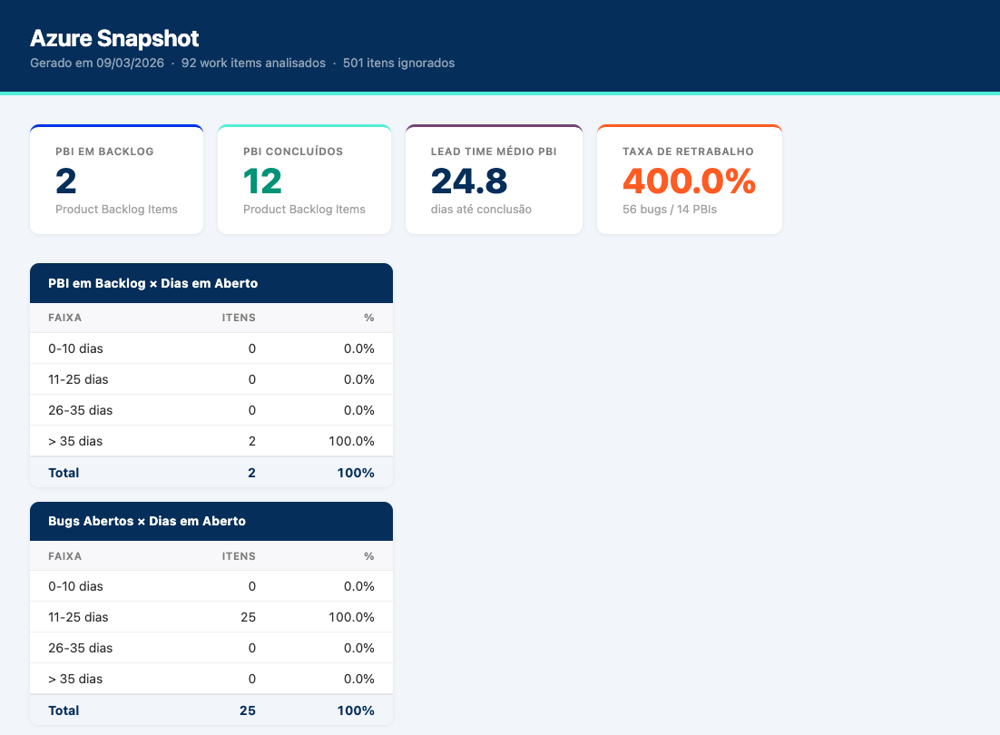

# azure-snapshot

Ferramenta para extrair métricas do Azure DevOps e gerar relatórios locais de backlog e retrabalho.

## Para que serve

Equipes que usam Azure DevOps acumulam dados valiosos sobre o andamento dos projetos, mas acessar essas informações de forma consolidada exige navegação manual entre boards, filtros e relatórios espalhados.

O azure-snapshot resolve isso: com um único comando, ele extrai os work items do projeto, analisa o estado do backlog e identifica itens de retrabalho (bugs, erros, impedimentos), entregando um relatório pronto para uso.

**Quem se beneficia:**

- **PMO e gerentes de projeto**: visão rápida do backlog atual e proporção de retrabalho, sem precisar abrir o Azure DevOps
- **Agilistas e Scrum Masters**: insumo para retrospectivas e conversas sobre qualidade e impedimentos
- **Líderes técnicos**: identificação de padrões de retrabalho por responsável e por tipo de item



**O que o relatório mostra:**

- Cards de resumo: PBIs em backlog, PBIs concluídos, lead time médio e taxa de retrabalho
- Gráfico de distribuição de PBIs em backlog por faixa de dias em aberto (0-10, 11-25, 26-35, >35 dias)
- Gráfico de distribuição de bugs abertos por faixa de dias em aberto

---

## Sobre a solução

### Pré-requisitos

- Python 3.11+ ou Docker
- Personal Access Token (PAT) do Azure DevOps com permissão de leitura em Work Items

### Configuração

O diretório `env/` não é versionado. Crie a estrutura manualmente antes de rodar:

```
env/
└── dev/
    └── env.yaml
```

Conteúdo do `env/dev/env.yaml`:

```env
AZURE_DEVOPS_ORG=sua-organização
AZURE_DEVOPS_PROJECT=seu-projeto
AZURE_DEVOPS_PAT=seu-personal-access-token
OUTPUT_DIR=output

# Configuração do workflow (ajuste conforme o processo do projeto)
DONE_STATES=Done,Closed,Resolved
REWORK_TYPES=Bug
REWORK_STATES=Reopened
EXCLUDE_TYPES=Test Plan,Test Suite,Test Case
```

| Variável | Descrição | Padrão |
|---|---|---|
| `AZURE_DEVOPS_ORG` | Nome da organização (aparece na URL do Azure DevOps) | — |
| `AZURE_DEVOPS_PROJECT` | Nome do projeto dentro da organização | — |
| `AZURE_DEVOPS_PAT` | Personal Access Token com permissão de leitura em Work Items | — |
| `OUTPUT_DIR` | Diretório de saída | `output` |
| `DONE_STATES` | Estados que indicam item concluído (separados por vírgula) | `Done,Closed,Resolved` |
| `REWORK_TYPES` | Tipos de work item que contam como retrabalho (separados por vírgula) | `Bug` |
| `REWORK_STATES` | Estados que indicam retrabalho, independente do tipo (separados por vírgula) | `Reopened` |
| `EXCLUDE_TYPES` | Tipos excluídos da análise de backlog — artefatos de QA (separados por vírgula) | `Test Plan,Test Suite,Test Case` |
| `GCS_BUCKET` | Nome do bucket GCS para upload (opcional — omitir desativa o upload) | — |
| `GCS_PREFIX` | Prefixo dos blobs no bucket | `azure-snapshot` |

O PAT pode ser gerado em: `User Settings > Personal Access Tokens` no Azure DevOps.

### Upload para o GCS (opcional)

Quando `GCS_BUCKET` está configurado:

- `make fetch` salva o CSV localmente e faz upload do Parquet para `gs://BUCKET/PREFIX/work_items_YYYY-MM-DD.parquet`
- `make report` faz upload do HTML para `gs://BUCKET/PREFIX/report.html`

A autenticação usa as credenciais padrão do GCP (Application Default Credentials). Em ambiente local, configure com:

```bash
gcloud auth application-default login
```

### Configuração por processo

Os tipos e estados variam conforme o processo configurado na organização:

| Processo | Tipos disponíveis | Estado "concluído" |
|---|---|---|
| **Agile** | Epic, Feature, User Story, Task, Bug, Issue | `Done` |
| **Scrum** | Epic, Feature, Product Backlog Item, Task, Bug, Impediment | `Done` |
| **CMMI** | Epic, Feature, Requirement, Task, Bug, Change Request | `Closed`, `Resolved` |

Exemplos de configuração:

```env
# Scrum — inclui Impediment como retrabalho
REWORK_TYPES=Bug,Impediment
DONE_STATES=Done

# CMMI
REWORK_TYPES=Bug,Change Request
DONE_STATES=Closed,Resolved
```

### Rodando local

**Com Docker:**

```bash
make fetch    # extrai work items e salva CSV em output/
make report   # lê o CSV mais recente e gera output/report.html
```

**Sem Docker:**

```bash
pip install -r requirements.txt

python -m app.cli fetch
python -m app.cli report
```

### Estrutura do projeto

```
app/
├── cli.py          # entry point dos comandos
├── config.py       # leitura das variáveis de ambiente
├── extract.py      # integração com a API do Azure DevOps
├── transform.py    # cálculo de backlog e retrabalho
├── report_html.py  # geração do relatório HTML com gráficos interativos
└── storage.py      # upload para o Google Cloud Storage
```

Os arquivos gerados ficam em `output/`:

```
output/
├── work_items_YYYY-MM-DD.csv   # dados brutos extraídos do Azure DevOps
└── report.html                 # relatório visual com gráficos (abrir no browser)
```
